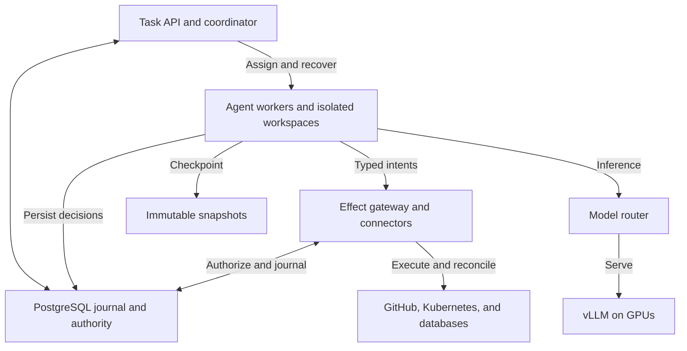
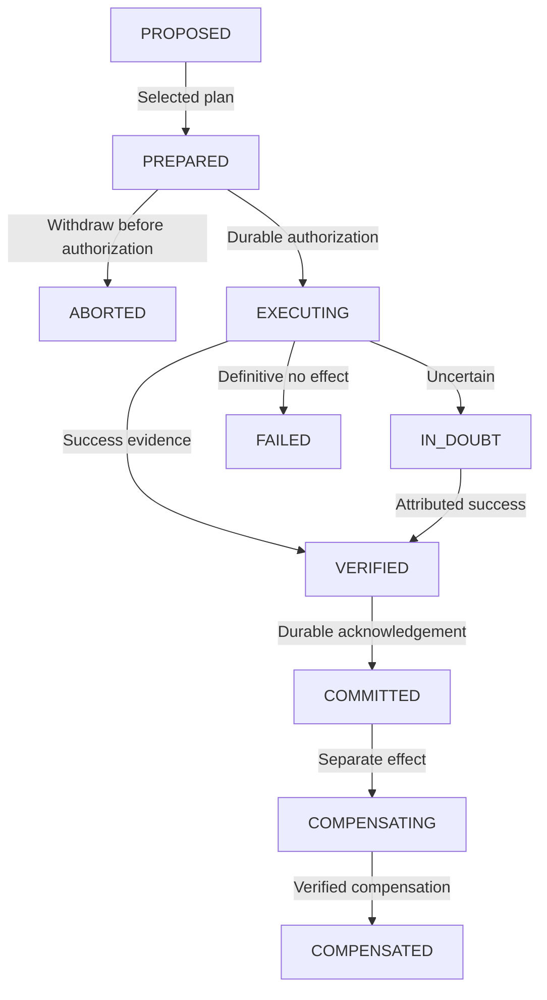

# Continuum Technical Specification

*A proposed execution runtime for agents that fork, recover, and act on external systems*

Version 0.1 • Design proposal • October 2, 2026

Continuum is a working name. The public project name remains to be selected. This document specifies intended behavior and evaluation criteria; it does not claim that the implementation exists, that correctness has been proved, or that any performance target has been achieved.

## Contents

- [1. Purpose and project thesis](#1-purpose-and-project-thesis)
- [2. Reader guide and requirement language](#2-reader-guide-and-requirement-language)
- [3. The problem through a concrete example](#3-the-problem-through-a-concrete-example)
- [4. Goals and scope](#4-goals-and-scope)
- [5. Definitions and identities](#5-definitions-and-identities)
- [6. Guarantees assumptions and impossibility boundaries](#6-guarantees-assumptions-and-impossibility-boundaries)
- [7. System architecture](#7-system-architecture)
- [8. Durable data model](#8-durable-data-model)
- [9. Execution and effect state machines](#9-execution-and-effect-state-machines)
- [10. The external effect protocol](#10-the-external-effect-protocol)
- [11. Fork selection and external consistency](#11-fork-selection-and-external-consistency)
- [12. Crash recovery cancellation and stale restores](#12-crash-recovery-cancellation-and-stale-restores)
- [13. Connector contracts and three reference integrations](#13-connector-contracts-and-three-reference-integrations)
- [14. Sandbox checkpoints and capability isolation](#14-sandbox-checkpoints-and-capability-isolation)
- [15. Model calls replay and version changes](#15-model-calls-replay-and-version-changes)
- [16. Proposed APIs and example usage](#16-proposed-apis-and-example-usage)
- [17. Operations security and observability](#17-operations-security-and-observability)
- [18. Self hosted inference and its evaluation](#18-self-hosted-inference-and-its-evaluation)
- [19. IntegrityBench design](#19-integritybench-design)
- [20. Metrics baselines and experiment reporting](#20-metrics-baselines-and-experiment-reporting)
- [21. Formal modeling and proof obligations](#21-formal-modeling-and-proof-obligations)
- [22. Related work and positioning](#22-related-work-and-positioning)
- [23. Implementation milestones and exit criteria](#23-implementation-milestones-and-exit-criteria)
- [24. Acceptance criteria and eventual claims](#24-acceptance-criteria-and-eventual-claims)
- [25. Open decisions and review questions](#25-open-decisions-and-review-questions)
- [26. References and verification notes](#26-references-and-verification-notes)

## 1. Purpose and project thesis

We will build an execution substrate for long-running autonomous agents whose local work can be checkpointed and forked, but whose actions on external services persist independently of that local work. The runtime will coordinate agent state, sandbox files, external action records, and worker authority so that crashes and speculative execution do not silently lose track of actions or trigger unsafe retries. We will operate a self-hosted open-weight model through vLLM on GPUs and Kubernetes to evaluate this runtime under real inference workloads.

The central question is how an agent can safely crash, resume, retry, or explore alternative branches when a restored local environment cannot restore GitHub, Kubernetes, a database, or another external service to its former state. A local checkpoint is therefore only part of the recovery problem. The runtime must retain an independent history of external effects and determine which actions remain valid, which have already happened, and which have an uncertain outcome.

Our proposed contribution is the joint contract among speculative branches, sandbox generations, durable external intents, and conditional authority to execute those intents. Durable workflow execution, journaling, idempotency, and compensation are established techniques. The project combines them around a narrower question: what execution semantics should govern a branchable agent that interacts with a shared external world? Novelty is a hypothesis to be assessed against related work, particularly DelAct, rather than an assumption.

The primary deliverable is a working runtime plus IntegrityBench, a reproducible fault-injection harness with an independent oracle for external effects. The grounding specification should allow an outside reviewer to assess the proposed guarantees, identify counterexamples, and determine whether the eventual measurements support the claims. The inference deployment is a required demonstration of AI infrastructure competence; autonomous tuning of that deployment is a later extension.

## 2. Reader guide and requirement language

Sections 3 through 6 establish the problem, scope, vocabulary, and guarantees. Sections 7 through 15 define the architecture, durable records, execution protocol, recovery, connectors, and sandbox behavior. Sections 16 through 21 cover APIs, operations, inference, IntegrityBench, and formal modeling. Sections 22 through 26 define the implementation plan, acceptance criteria, unresolved decisions, and references.

MUST identifies a requirement of the proposed first complete implementation. SHOULD identifies a recommended choice that can change through a documented design decision. MAY identifies an optional feature. Each guarantee is conditional on the trust and durability assumptions in Section 6. A target is an evaluation objective, not an observed result. A proposed interface is illustrative and must be refined during implementation.

The first complete implementation means the full core research prototype. The initial vertical slice is intentionally smaller: one durable effect, one recoverable worker, and a controlled provider. Kubernetes deployment, all three real connectors, and inference measurements arrive in later milestones. This distinction keeps the first experiment small without reducing the final project's intended scope.

## 3. The problem through a concrete example

Consider an agent asked to investigate a deployment failure, prepare a fix, open an issue, and update a Kubernetes workload. Its conversation state and workspace are saved at checkpoint C17. The agent creates issue number 123, but crashes before recording the response. Recovery restores C17, whose local files and conversation contain no issue receipt. Re-running the apparent next step may create issue number 124. Both issues are real even though the recovered agent remembers neither.

A second failure occurs during speculation. Two branches inherit C17 and propose different repairs. Each can test changes in its own files. If each has unrestricted credentials, each can independently update the production workload. Selecting a winning branch afterward cannot erase the losing branch's mutation. Speculation has already changed the shared world.

A third failure involves delayed execution. Worker W1 sends a request, then becomes unreachable. Worker W2 takes over and increments the execution epoch. W1's later submissions can be rejected, but the request W1 already sent may still commit at the provider. A new epoch does not revoke a network packet or make a remote operation disappear. Treating takeover as permission to retry would reproduce the first failure.

Continuum will address these cases by mediating external operations through typed connectors and a durable effect gateway. Speculative branches generate proposed intents rather than dispatching external writes. A selected branch receives scoped commit authority. Before each dispatch, the gateway records the exact request, checks current authority, validates relevant assumptions, and establishes a durable attempt. If the response is lost, recovery reconciles the recorded attempt instead of trusting the restored sandbox.

This protocol is deliberately conservative where the provider offers insufficient evidence. An ambiguous effect can remain IN_DOUBT. A system that blocks and reports uncertainty can preserve safety even when it cannot guarantee progress. Completing every task by retrying indefinitely would be an incompatible objective.

## 4. Goals and scope

### 4.1 Core goals

- Define and implement fork-aware execution semantics for an agent acting on shared external services.
- Persist agent decisions, effect intents, attempts, observations, and outcomes before those records become necessary for recovery.
- Restore application-level agent state and sandbox files while preserving the current external-effect history and rejecting obsolete authority.
- Demonstrate safe handling of crashes, lost responses, delayed commits, duplicate submissions, competing workers, and stale restores.
- Make connector capabilities explicit so retry policy follows provider semantics rather than the language model's confidence.
- Publish repeatable evaluation workloads, failure schedules, oracle results, and limitations.
- Deploy an open-weight model through vLLM on GPU-backed Kubernetes infrastructure and measure task-level and inference-level performance.

### 4.2 Core technology choices

The reference implementation SHOULD use Go for the control plane, effect gateway, scheduler, and connectors; Python for agent integration and benchmark workloads; PostgreSQL for durable metadata and the journal; immutable blob storage for workspace snapshots and large payloads; and Kubernetes for worker and inference deployment. OpenTelemetry traces and Prometheus metrics will support operational diagnosis. These choices are proposed engineering decisions, not requirements imposed by the protocol.

The scheduler assigns tasks to existing Kubernetes workers or creates worker jobs through normal Kubernetes mechanisms. It is an application scheduler, not a replacement for the Kubernetes node scheduler. The runtime relies on PostgreSQL for its metadata consistency and on existing container isolation for execution. It will not implement its own consensus algorithm, distributed database, hypervisor, GPU scheduler, or model-serving engine.

### 4.3 Explicit exclusions from the core

The core will not promise generic exactly-once external effects, an atomic transaction across multiple independent APIs, complete rollback of external actions, deterministic reproduction of arbitrary model inference, or transparent checkpointing of arbitrary running processes. It will not merge arbitrary branch histories after external execution. It will not infer real-world authorization from the quality of an agent's plan.

The prototype will support a limited catalog of typed operations on GitHub, Kubernetes, and PostgreSQL. Arbitrary shell commands with unrestricted network access are outside the guarantee. A command can make hidden external writes through scripts, SDKs, or downloaded code; the runtime cannot classify those effects reliably from command text alone. Mediated networking and credential isolation are prerequisites for the advertised semantics.

Closed-loop inference optimization is a stretch goal. Multi-region operation, hostile multi-tenant isolation, nested fork trees, general process-memory snapshots, and production disaster recovery remain later work. The project should be credible as a research and portfolio prototype before these features are attempted.

## 5. Definitions and identities

| Term | Meaning |
| --- | --- |
| Task | A user-submitted objective with a policy, budget, and stable task identifier. |
| Execution | One durable lineage of work for a task, including resumptions and branches. |
| Branch | A continuation from a checkpoint with its own local state and proposed effects. |
| Epoch | A monotonically increasing authority generation for an execution. It changes on takeover or authority revocation. |
| Worker attempt | One assignment of an execution or branch to a particular worker. |
| Sandbox generation | An immutable identity for a captured workspace and its manifest. A restored sandbox receives fresh runtime authority. |
| Intent | A typed description of a proposed external operation, including target, payload, and preconditions. |
| Effect | One logical external operation with a durable identity independent of retry attempts. |
| Attempt | One authorized dispatch opportunity for an effect. Its outcome may be uncertain. |
| Receipt | Evidence about an effect, such as a provider object identifier, request identifier, version, or reconciliation observation. |
| Commit authority | A scoped right for the selected branch to request dispatch of specified effects. It is enforced by the gateway. |
| Read set | External observations and versions on which a proposed plan depends. |
| Effect frontier | A durable cursor and associated effect outcomes that describe the acknowledged external history at a checkpoint. |
| Reconciliation | A provider-specific procedure that obtains evidence about a previously attempted effect. |
| Compensation | A new external operation intended to counteract part of an earlier operation. It has its own identity and failure modes. |

An effect ID MUST remain stable across retry, recovery, and worker replacement. It MUST NOT be derived from the current epoch or a request attempt number. A proposed scheme is a server-assigned UUID associated with a unique tuple of execution ID, branch ID, durable decision ID, and operation ordinal. A canonical payload digest detects accidental reuse of that identity with different parameters. Identical payloads in two distinct logical operations do not imply the same effect: an agent might legitimately create two similar records.

The runtime MUST persist the durable decision and allocated effect IDs before it allows any dispatch. If a client repeats a decision submission after a timeout, the same decision key returns the existing decision and effect IDs. Reusing a decision key with different content is an error. Forks receive separate branch identities, so independent proposals remain distinguishable. Shared ancestor effects are referenced, never copied into new dispatchable operations.

Provider idempotency keys SHOULD bind to the logical effect ID, tenant, connector, and operation version. The journal must retain enough metadata to reuse precisely the same key and request parameters. Connector or policy upgrades cannot silently change the meaning of a pending effect.

## 6. Guarantees assumptions and impossibility boundaries

### 6.1 Guarantees within the managed boundary

The runtime MUST durably account for every dispatch it authorizes. This means it records a prepared effect and a dispatch attempt before sending the request. It does not mean it always knows the remote result. A recorded uncertain attempt is accounted for; an external action without a corresponding intent is not.

Only the branch selected for a fork group may enter external dispatch. Selection MUST be atomic in the metadata store. Stale workers cannot acquire new dispatch authority or finalize metadata using an obsolete epoch. Restoring a sandbox MUST NOT delete or regress the effect journal, reset an effect to unexecuted, or restore old credentials.

If a provider offers a valid idempotency contract, retries MUST preserve its key and payload. If a provider supports an atomic conditional mutation, the connector MUST encode the precondition in that mutation. For operations lacking such guarantees, the runtime MUST retain uncertainty rather than assume that a timeout means failure or that a temporarily absent object means no request can still commit.

### 6.2 What fencing does and does not establish

There are two different boundaries: durable authorization inside Continuum and actual application of an operation at the provider. The former can be serialized using PostgreSQL transactions. The latter may occur later and outside the runtime's control. The proposed linearization point for dispatch authority is the transaction that creates an immutable authorized attempt while checking the current epoch, winning branch, and effect state. Authority issued before revocation remains an outstanding obligation until its result is resolved.

The guarantee is therefore that stale authority cannot create a new authorized attempt. An attempt already authorized may reach the provider after takeover or cancellation. For that reason, a successor MUST adopt and reconcile outstanding attempts and MUST block conflicting replacement operations until their outcomes are resolved or a provider-level protection makes overlap safe. A stronger guarantee that no stale operation can apply after revocation requires a provider that itself enforces fencing or equivalent conditional state.

Gateway failover follows the same rule. A dispatcher crash after authorization but before an observable response creates uncertainty, including the possibility that the request was never sent. A lease alone does not prove that the old dispatcher cannot resume. Dispatchers MUST NOT initiate a second ambiguous non-idempotent attempt simply because the first dispatcher's lease expired. This can sacrifice availability; the benchmark must measure that tradeoff.

### 6.3 Why generic exactly once is unavailable

After a lost response, two histories may be indistinguishable to the runtime: the provider received nothing, or it committed the request and the response disappeared. Retrying can duplicate the second history; refusing to retry can leave the first history incomplete. No journal entry, prompt, or local snapshot distinguishes them without an additional provider contract.

A queryable postcondition helps only when it is sufficiently attributable and complete. Finding an object with the intended marker can establish that the effect happened. Not finding it does not establish that it will never happen. The original request could still be in flight, the query could be stale, or the marker could have been edited or removed. A safe retry needs provider idempotency, a definitive failed outcome, or an explicitly justified bound after which both in-flight completion and delayed visibility are excluded. Otherwise the effect remains IN_DOUBT.

Compensation also does not establish exactly once or atomic rollback. Closing an issue does not unsend its notifications. Restoring an old deployment configuration does not undo the period during which the new configuration served traffic. Compensation can fail or overwrite later legitimate changes. It requires its own conditional checks and durable protocol.

### 6.4 Trust and durability assumptions

The core assumes trusted runtime services, correctly implemented connectors, a metadata store that preserves acknowledged commits under the configured failure model, and a network boundary that prevents sandbox bypass. Workers and model-generated content are untrusted for authority decisions. The journal's PostgreSQL configuration MUST preserve acknowledged writes; asynchronous disaster-recovery replicas must not be promoted with data loss while retaining stronger claims.

The initial fault model includes process death, node loss, response loss, delays, partitions, duplicated client submissions, and obsolete local snapshots. It excludes Byzantine providers, compromised gateway credentials, arbitrary corruption of the authoritative journal, and a provider lying about its documented guarantees. Provider-side edits by other users are allowed and must be treated as conflicts or changed observations where detectable.

Liveness requires eventual access to the durable store, available workers, and a provider whose operation contract permits resolution or safe retry. Permanent partitions and unverifiable remote outcomes can block indefinitely. These conditions must accompany any recovery-rate claim.

## 7. System architecture

The architecture separates local computation, authoritative execution metadata, and privileged external dispatch. Model inference is a service used by the agent runtime; it is not downstream of the effect transaction path. The effect gateway mediates external mutations, while the model router serves inference requests independently.



Figure 1. Workers perform local computation and model calls. Durable metadata governs branch selection and effect dispatch. External credentials remain in the gateway.

### 7.1 Control plane

The Task API accepts objectives, retrieves execution history, and handles cancellation and resolution requests. The scheduler assigns work under durable leases and resource budgets. The execution coordinator owns branch selection, epoch changes, checkpoint publication, and task state transitions. A reconciliation service scans unresolved effects and performs bounded, connector-approved observations and retries.

These services MAY share one Go process initially. Their responsibilities should still be separate packages so the gateway and reconciliation path can be tested independently of the agent. Kubernetes reconciles worker pods; the execution coordinator reconciles logical task state. A pod being alive is not evidence that it owns the current execution epoch.

### 7.2 Agent and sandbox plane

The Python agent adapter receives persisted state and a branch-scoped runtime token. It calls the model router, runs local commands, obtains external observations through connector APIs, and submits typed decisions. It never receives provider mutation credentials. Local shell execution occurs in a container with a controlled workspace, limited resources, and restricted egress.

A sandbox service captures and restores immutable workspace generations. The initial implementation uses application checkpoints plus file snapshots, not a snapshot of process memory. A recovered worker restarts the agent loop from persisted state. Any background process that must outlive a checkpoint requires an explicit supervised-task record or is terminated before the checkpoint is published.

### 7.3 Effect plane

The effect gateway validates requests against current execution authority, dispatches supported connector operations, and records evidence. It MUST be the only component with credentials capable of the managed external mutations. The connector registry declares operation capabilities and versions. Reconciliation is separate from model reasoning: the agent may explain a timeout, but only the connector's verified evidence can change the effect outcome.

The gateway MUST explicitly control HTTP retries, redirect handling, and SDK retry behavior. A library that transparently retries a POST can duplicate an effect beneath the journal. One recorded attempt must correspond to the connector's declared wire behavior. Infrastructure proxies used in the benchmark must also have known retry policies.

### 7.4 Persistence and inference planes

PostgreSQL stores executions, events, branches, effects, attempts, receipts, read sets, capabilities, checkpoint manifests, and model-call results. Blob storage retains immutable workspace snapshots and larger payloads. Telemetry is useful for diagnosis but is not a correctness log.

The model router accepts authenticated inference requests, applies task and branch budgets, and forwards them to vLLM. A GPU pool runs the selected open-weight model. Inference replicas can fail independently of the runtime. Losing an inference response may waste compute; it must not itself authorize an external write. The durable model-result protocol in Section 15 handles this boundary.

## 8. Durable data model

### 8.1 Record families

| Record | Required fields and purpose |
| --- | --- |
| Execution | IDs, task status, current epoch, current owner, lease expiry, runtime version, policy version, next event sequence. |
| Branch | Parent and checkpoint IDs, fork group, lifecycle state, selected plan digest, selection generation, resource budget. |
| Event | Execution sequence, event type, actor, epoch, record references, payload digest, timestamp. |
| Decision | Stable client decision key, branch ID, model-result reference, canonical plan digest, allocated effects. |
| Effect | Stable ID, operation version, target scope, canonical request digest, preconditions, dependency IDs, outcome state. |
| Attempt | Attempt ID, effect ID, dispatch authorization sequence, epoch at authorization, dispatcher ID, provider key, transport observations. |
| Receipt | Effect and attempt IDs, source, raw evidence reference, observed time, provider object/version IDs, interpretation version. |
| Checkpoint | Agent-state reference, sandbox manifest and digest, journal cursor, effect frontier, code/model/tool/policy versions. |
| Read observation | Provider and target, value digest, version token where available, observation time, validity rule. |
| Model call | Stable call ID, request digest, model and serving configuration, durable result reference, acceptance status, usage. |
| Resolution | Effect ID, actor identity, asserted outcome, evidence, disposition, time, related replacement or compensation IDs. |

The relational schema is a proposed minimum. Large raw responses SHOULD be stored as immutable blobs with hashes and retention metadata rather than repeated inside every event. Secret values MUST be excluded or encrypted separately. An observation's timestamp indicates when the runtime saw it, not a proof of global ordering at the provider.

### 8.2 Atomic metadata transitions

Each correctness-relevant state transition MUST update the relevant materialized rows and append its event in one database transaction. Unique constraints enforce stable decision submission, effect identity, attempt numbering, and one selected branch per fork group. Guarded row updates compare the expected epoch and state. A rejected stale update changes neither the materialized state nor the authoritative event history.

The journal is authoritative history, while relational rows are its maintained indexes and current views. For the prototype, the same transaction writes both; the project does not require a fully generic event-sourcing framework. Sequence numbers are scoped to an execution, avoiding a global counter bottleneck. Cross-execution conflict scopes use separate resource rows and explicit locking where supported.

Transactions SHOULD use row locking or suitable compare-and-set updates for narrow transitions. PostgreSQL serializable isolation is an option for complex metadata decisions, and serialization failures must restart the complete metadata transaction. No database transaction may be held open across an external network call. Such a transaction cannot make the remote call atomic and would tie database locks to provider latency. [9]

### 8.3 Retention and database recovery

Pending effects, unresolved attempts, lineage, idempotency-key bindings, and tombstones MUST outlive all supported retries and snapshot restores. Garbage collection may remove large bodies after a policy-defined period but must preserve the identities and outcomes required to reject replayed effects. Restoring an old runtime database backup is a different event from restoring a sandbox: it can erase knowledge of external writes. Automatic write dispatch MUST remain disabled after a journal rollback until an operator completes reconciliation under a documented recovery procedure.

## 9. Execution and effect state machines

Execution, branch, and effect states are distinct. An execution can be running while one branch is speculative; an effect can be IN_DOUBT while the sandbox is healthy. Conflating these states would make recovery rules difficult to reason about.

### 9.1 Execution and branch states

Execution states SHOULD include QUEUED, RUNNING, RECOVERING, BLOCKED, CANCELLING, SUCCEEDED, FAILED, and CANCELLED. BLOCKED includes unresolved external uncertainty, a required resolution, or an unavailable dependency. FAILED must describe a known unsuccessful task outcome; it cannot hide an uncertain external operation. CANCELLED requires that outstanding actions are resolved or that the status explicitly retains unresolved effects.

Branch states SHOULD include SPECULATIVE, PROPOSED, SELECTED, COMMITTING, COMPLETED, REJECTED, and ABANDONED. Selection freezes the plan digest. A branch can be rejected before it obtains any dispatch authorization. Once a selected branch has an authorized attempt, replacing its plan requires a new explicit continuation after resolution; the runtime cannot behave as though a different branch won originally.

### 9.2 Effect states

| State | Meaning and permitted next action |
| --- | --- |
| PROPOSED | Branch-local intent exists. No external dispatch is permitted. |
| PREPARED | Winning plan has an immutable request, policy decision, and effect identity. It can request dispatch authorization. |
| EXECUTING | An attempt is durably authorized. Remote application may be pending, completed, or absent. |
| IN_DOUBT | Available evidence cannot determine the remote outcome. Reconcile, safely reuse a provider key, or await resolution. |
| VERIFIED | Connector has persisted sufficient attributable evidence for the declared success condition. |
| COMMITTED | Verified outcome and result exposed to the agent are durably acknowledged in the execution history. |
| FAILED | Definitive failure or rejected precondition establishes the intended effect did not occur under this attempt contract. |
| ABORTED | Intent was withdrawn before any dispatch authorization. |
| COMPENSATING | A separate compensating effect has been proposed or authorized. Original history remains preserved. |
| COMPENSATED | Compensating effect was verified and acknowledged. Residual consequences remain possible. |



Figure 2. Representative lifecycle transitions. The retry and reconciliation rules in the text also permit safe retries from IN_DOUBT and definitive failure after reconciliation. Compensation is a separately tracked external operation.

A verified result may be marked committed in the same metadata transaction that records its evidence. The logical distinction still matters: provider application precedes local acknowledgement. COMMITTED means Continuum has acknowledged the outcome, not that it atomically controlled the provider's commit. Transitions from IN_DOUBT to another attempt are allowed only under the connector's retry rules. A timeout, generic 5xx response, or expired lease is not a definitive failure by itself.

Evidence that appears later can resolve IN_DOUBT, but it cannot erase the earlier attempt. Detecting multiple attributed objects MUST raise an integrity violation rather than selecting one arbitrarily. An effect's completed result remains immutable; later external drift is recorded as a new observation or task, not as retroactive removal of its historical outcome.

## 10. The external effect protocol

### 10.1 Prepare

The agent submits a decision containing typed intents, dependencies, and a read set. The coordinator allocates or retrieves stable identities, canonicalizes parameters, and persists the plan. Validation rejects unsupported operations, malformed targets, budget violations, and missing preconditions. Speculative branches stop here with PROPOSED effects.

When a branch is selected, the coordinator freezes its plan digest and prepares the approved effects. A changed request requires a new logical effect ID. The canonicalization rules MUST define field ordering, omitted defaults, string encoding, and connector-specific semantic normalization. A digest is a consistency check, not a source of authorization or a proof that an operation is desirable.

### 10.2 Authorize dispatch

Immediately before an attempt is authorized, the gateway checks the current epoch, authenticated owner, unexpired authority, selected branch, scoped policy, plan digest, dependencies, and conflict reservation. The final metadata transaction repeats the authority and state checks so they cannot change between a preliminary check and authorization. The gateway validates the read assumptions that can be checked. Where a provider supports atomic preconditions, those conditions are attached to the actual mutation; a separate read followed by an unconditional write does not close a race.

In one short metadata transaction, the gateway creates the immutable attempt, records the authority decision, and transitions the effect to EXECUTING. This is the internal authority linearization point. If the transaction's acknowledgement is lost, the gateway must query the attempt by its stable identity before doing anything further. It cannot allocate a replacement attempt because it is unsure whether its own transaction committed.

The initial implementation SHOULD serialize dispatch within one execution and use conservative conflict reservations for managed target scopes. A reservation prevents competing managed plans from being dispatched to the same scope, but it does not lock out human users or other applications at the provider. Unknown conflict relationships require a broader reservation or an explicit weaker guarantee.

### 10.3 Execute

A trusted dispatcher sends the recorded request through the versioned connector. It uses the same provider idempotency key where one is supported and valid. The dispatcher captures transport facts, response bodies, and provider request IDs. The network call occurs outside the database transaction.

For an ambiguous non-idempotent attempt, dispatcher replacement must not dispatch again. The original authorized send might still occur, even if no send timestamp was persisted. If the original dispatcher is known to be terminated, that closes one local source of delayed send but does not prove that a request already accepted by the provider cannot finish. Remote reconciliation remains necessary.

### 10.4 Verify and acknowledge

The connector evaluates the declared success predicate using the response or provider observations. It must distinguish acceptance from completion. For an asynchronous API, a returned operation ID can establish acceptance while final success requires later polling. Continuum must record both facts and wait for the task's specified completion criterion.

Once evidence is sufficient, the gateway records the receipt and updates the effect to VERIFIED or COMMITTED in a guarded transaction. If the current epoch changed, the old dispatcher cannot finalize state directly. Its evidence can be ingested through a restricted receipt path bound to the immutable attempt; the current reconciler decides the transition. Receipt ingestion conveys evidence, never new dispatch authority.

The worker receives results only after the outcome is durably acknowledged. If that delivery fails, requesting the same effect returns the recorded outcome. It does not call the provider again. The next agent checkpoint references this outcome and the corresponding journal cursor.

### 10.5 Ambiguous outcomes

The runtime persists IN_DOUBT when the response is lost, the status is insufficient, or verification is inconclusive. The reconciler chooses among observing again, reissuing with a valid provider idempotency key, recording definitive failure, or blocking for explicit resolution. The reason and supporting evidence MUST be recorded for each decision. Retries use bounded backoff and a task budget but may not loosen the semantic safety condition to meet a deadline.

The runtime MUST retain reservations for effects that could still commit and conflict with later actions. Independent work may continue if its lack of dependency is explicit. For the first implementation, stopping the affected execution is an acceptable conservative policy. Releasing all reservations on timeout would make a delayed old request race a replacement plan.

### 10.6 Proposed recovery procedure

```python
def recover_effect(effect_id, current_epoch):
    effect = load_effect_with_attempts(effect_id)
    if effect.state == "COMMITTED":
        return effect.durable_result
    evidence = connector.observe(effect)
    persist_observation(effect_id, evidence)
    if evidence.proves_attributed_success:
        return acknowledge_under_current_epoch(effect_id, evidence)
    if evidence.proves_terminal_no_effect:
        return record_failure_or_retry_by_policy(effect_id, evidence)
    if connector.valid_idempotency_contract(effect):
        return authorize_same_key_retry(effect_id, current_epoch)
    retain_conflict_reservation(effect_id)
    mark_in_doubt(effect_id, reason=evidence.reason)
    return BLOCKED
```

This pseudocode intentionally omits database and transport implementation detail. The predicates require connector-specific evidence; the implementation must not substitute a missing object for proves_terminal_no_effect. Safe same-key retries may overlap only if the provider contract explicitly handles concurrency and the key's retention window remains valid.

## 11. Fork selection and external consistency

### 11.1 Speculative execution

A fork begins from a published checkpoint. Child branches inherit the ancestor's acknowledged effects, agent state, and immutable workspace generation. Each receives a distinct writable workspace and a capability limited to local computation, approved observations, model calls, and intent proposal. Fork creation does not grant mutation authority.

Speculative branches may call expensive services, consume GPU time, and disclose data through reads if policy permits. These are real costs and information flows even without domain mutations. The runtime must apply budgets and access controls to them. A nominally read-only API that launches a paid job or changes provider state must be classified accordingly; HTTP GET is not sufficient evidence of harmlessness.

The initial prototype MAY use ordinary copied directories or archive restore rather than copy-on-write filesystems. Branch isolation must be verified: writable workspace paths and caches cannot alias one another in ways that let a losing branch alter the winner's artifact. External caches and shared volumes require explicit treatment.

### 11.2 Winner selection

The selector can be a deterministic evaluator, a human choice, or a model-backed ranking recorded as a durable decision. Selection quality is independent of execution integrity. A correct runtime can safely execute a poor plan; task correctness must be measured separately.

The coordinator uses one metadata transaction to compare the fork group's selection generation, select exactly one eligible branch, freeze its plan, and revoke competing proposal-to-dispatch transitions. Racing selections must yield one winner and a visible conflict for the other request. A selection retry with the same key returns the existing winner.

Before the winner dispatches, the runtime revalidates its read assumptions. If they no longer hold, it records a conflict and replans from current observations. It does not silently rewrite the frozen payload under the original effect ID. If a new branch is needed, it starts from a checkpoint that includes all known prior external history.

### 11.3 Limits of optimistic validation

Read-set validation is an optimistic concurrency technique: compute using observations, then check assumptions before writing. It yields a strong guarantee only for assumptions the provider can enforce atomically with the mutation. Version checks on one resource do not create a transaction across several resources or several services. An observation may change immediately after revalidation.

The spec therefore claims conditional protection for supported individual mutations and explicit conflict detection where available. It does not claim global serializability for arbitrary agent plans. Unversioned GitHub observations, cross-service dependencies, and absence checks receive documented weaker semantics. Plans that require a true atomic cross-service invariant must be rejected, redesigned as a saga, or handled by a service that provides that transaction.

### 11.4 Plan execution and compensation

A winning plan consists of a dependency graph of effects. The first implementation SHOULD execute a topological sequence. Each effect is individually prepared, dispatched, and acknowledged. If the second effect fails after the first commits, the plan is partially applied. The journal exposes that result; it cannot label the entire plan atomically rolled back.

Compensation is optional and connector-specific. The plan must specify which completed effects can be counteracted, required current-state preconditions, and the remaining consequences. Compensations receive new effect IDs linked to their originals. A failed or ambiguous compensation leaves the execution blocked or partially compensated. A losing branch's plan is never used as an automatic substitute after the winner has begun external dispatch.

## 12. Crash recovery cancellation and stale restores

### 12.1 Worker takeover

The scheduler acquires ownership by a guarded metadata transition and increments the epoch when taking over an expired or revoked execution. Lease times use the metadata store's clock for authority decisions. Worker clocks are not a safety basis. An epoch is monotonic but not secret; authorization also requires authenticated identity, scope, and current stored state.

The replacement worker restores a valid checkpoint and queries the authoritative journal after its cursor. It adopts committed results and outstanding attempts before producing new external intents. An old worker may still run local code or issue already authorized traffic from a trusted dispatcher path, but it cannot create new authorized attempts or acknowledge metadata with the obsolete epoch. Worker tokens should be short-lived; provider credentials should never be present in the sandbox.

### 12.2 Recovery at specific boundaries

| Failure boundary | Required recovery behavior |
| --- | --- |
| Before intent persistence | No managed dispatch was possible. Recompute local decision if needed. |
| After PREPARED before authorization | Reuse the effect identity. Revalidate and authorize under the current epoch. |
| After authorization before known send | Treat the attempt as potentially sent. Use connector reconciliation or valid same-key retry. |
| After provider commit before response | Reconcile the existing attempt. Never infer failure from the missing response. |
| After response before receipt persistence | Obtain attributable provider evidence or retain IN_DOUBT. |
| After durable acknowledgement before worker delivery | Return the durable result without dispatch. |
| After external effect before a newer sandbox snapshot | Replay acknowledged outcome into the agent continuation; do not roll back the external journal. |
| After branch selection before first attempt | Resume the selected frozen plan, or explicitly abort before dispatch. |
| After partial plan execution | Resume or compensate with the completed prefix retained. Do not select a replacement winner invisibly. |
| During compensation | Reconcile the compensating effect using the same rules as any other write. |

### 12.3 Restoring an older checkpoint

A checkpoint contains a sandbox generation and a journal cursor, not the authority to redefine history. If it predates committed effects, restore must append a recovery context explaining those effects and either replay a compatible application continuation or require replanning. A sandbox is not safe merely because its files load successfully.

The first implementation SHOULD support checkpoints only at controlled agent-loop boundaries and reject restores that cannot reconcile the saved continuation with later effects. For example, restoring before a database migration while preserving later deployment mutations may invalidate the agent's assumptions. Continuum must block rather than pretend that adding receipts to the prompt proves semantic consistency.

Restore creates a fresh worker assignment and token. Current branch selection, epoch, and unresolved reservations are loaded from the journal. They are never taken from saved environment variables. A historical snapshot may be used for offline inspection with no write authority even when live continuation is inadmissible.

### 12.4 Cancellation and operator resolution

Cancellation stops new authorization, revokes the current worker assignment, and cancels local or inference work where possible. It does not guarantee cancellation of an already authorized remote request. The task remains CANCELLING or BLOCKED while such effects are unresolved, or reports CANCELLED_WITH_UNRESOLVED_EFFECTS through an explicit API disposition. The interface must not conceal those effects behind an ordinary cancelled label.

An operator may submit evidence that an effect succeeded or definitively failed, continue observation, initiate a supported compensation, or explicitly accept the risk of a replacement attempt. Risk acceptance does not convert an uncertain history into an exactly-once guarantee. The resolution record identifies the actor, evidence, reason, and new effects. Directly editing database outcome rows is not a supported resolution mechanism.

## 13. Connector contracts and three reference integrations

### 13.1 Required operation contract

Each connector MUST implement versioned schema validation, request canonicalization, a target/conflict-scope function, precondition handling, dispatch, response interpretation, and reconciliation. It declares whether the operation has provider idempotency, conditional writes, stable attribution, asynchronous completion, bounded visibility, or compensation support. These properties are independent: a compensatable operation need not be idempotent.

| Contract field | Required interpretation |
| --- | --- |
| Idempotency | Key scope, payload binding, concurrent request behavior, retention duration, and replayed response behavior. |
| Preconditions | Which versions or predicates are atomically enforced by the provider. |
| Observation | What can be queried, its consistency, attribution strength, and possible late-commit behavior. |
| Success predicate | Acceptance versus completion and the exact property established by a receipt. |
| Failure predicate | Evidence sufficient to establish that this attempt cannot later apply the effect. |
| Conflict scope | Resource identities conservatively reserved against competing managed writes. |
| Compensation | Supported inverse-like operation, current-state checks, and irreversible residual consequences. |
| Retry budget | Backoff and operational limits subordinate to semantic retry eligibility. |

A connector conformance suite MUST test that declared capabilities match behavior under delayed commits, concurrent retries, key expiry, edited markers, and failed observations. A connector claiming more than the provider guarantees is a correctness bug in Continuum. Connector versions and capability manifests are pinned for in-flight effects.

### 13.2 GitHub issue creation

The initial GitHub operation SHOULD create an issue in an isolated test repository. The request includes a stable effect marker in the body and records the repository, exact body digest, and known issue ID when returned. The documented create-issue endpoint describes a POST operation and returned issue data; Continuum will not assume a generic provider idempotency key for it. [7]

Reconciliation lists or queries candidate issues and requires an exact, attributed marker match. One match can support success; several matches demonstrate a duplicate or attribution failure. No match is inconclusive while a request might still commit or observations may lag. The runtime MUST not automatically re-POST solely because a search returns nothing. This connector intentionally demonstrates conservative blocking for a real API with a weak retry contract.

A marker is an audit aid, not a uniqueness constraint. Users can copy or remove it, notifications can be emitted before reconciliation, and provider pagination or permissions can hide objects. Stronger issue-create semantics would require an external contract beyond a searchable marker. Closing a created issue is a possible compensation with its own effect identity; it does not undo notifications or references.

### 13.3 Kubernetes object creation and conditional updates

The Kubernetes connector SHOULD support creation of a named ConfigMap in a dedicated namespace and a conditional update of one managed object. Use a stable object name for the logical create and verify its UID, effect annotation, and relevant spec fields. Treat a name conflict with a different object as a conflict, not success. Updates use the provider's resourceVersion mechanism to detect conflicting changes. [8]

The runtime must separate API acceptance from controller-level readiness. A successfully written Deployment spec is a completed spec mutation, but it is not evidence that pods became ready. Readiness is a subsequent observation or task criterion. Avoid generated names for the initial create operation because they make retry attribution harder. No claim of runtime epoch enforcement is made unless a provider-side mechanism explicitly checks it.

Compensation requires verifying that the current managed object is still the one created or changed by the effect and has not been replaced. It should not delete or overwrite an object modified by unrelated actors. A delete/recreate cycle must be distinguished by UID, and desired-state convergence must not be confused with evidence of one exact historical write.

### 13.4 PostgreSQL application writes

The PostgreSQL connector SHOULD demonstrate a trusted mutation that writes an application row and an effect-deduplication row in one target-database transaction. A unique logical effect key and recorded request digest bind retries to the same operation. If the target also contains Continuum's relevant acknowledgement record and authority check in that same transaction, the application mutation and acknowledgement can commit atomically.

If the application database is separate from the journal database, those two acknowledgements are not atomic. The target transaction still gives a durable deduplication receipt, which the journal reconciles afterward. The spec must state which deployment is measured. Checking an epoch in one database and mutating another does not create atomic fencing across them.

The connector is a trusted operation catalog, not arbitrary model-generated SQL with full database privileges. It must prevent bypass of deduplication, define conditional updates for concurrent application writers, and retain effect keys through the supported recovery window. This integration provides the strongest reference case; GitHub provides the deliberately weaker case. Comparing them makes the provider boundary visible.

## 14. Sandbox checkpoints and capability isolation

### 14.1 Checkpoint contents and publication

A checkpoint MUST contain serialized agent-loop state, conversation and accepted model-result references, pending decision references, workspace manifest, artifact digests, the acknowledged effect frontier, and pinned runtime/model/tool/policy identities. The frontier is not simply the highest committed effect number: it must identify unresolved gaps and dependency outcomes. The initial checkpoint format can include a journal sequence plus an explicit map of effects relevant to the continuation.

Checkpoint publication follows a two-stage protocol. First, pause the agent at a safe boundary and quiesce local workspace writers. Capture immutable files and state, upload blobs, and verify their hashes. Second, commit the manifest references and checkpoint event in PostgreSQL. A crash before publication leaves unreferenced blobs eligible for later collection. A published checkpoint must never point to incomplete or mutable data.

External dispatch SHOULD be drained or suspended during the initial implementation's checkpoint capture, while unresolved attempts remain explicitly listed. The journal can still receive late receipts. A consistent metadata transaction selects the cursor and frontier represented by the checkpoint; later events are reconciled at restore. The design must not imply an atomic snapshot of the provider together with the workspace.

### 14.2 Isolation and mediation

Sandboxes MUST use separate writable workspaces, non-root execution, resource limits, and a policy that prevents direct access to managed external mutation endpoints. Provider credentials, cloud-instance metadata credentials, Kubernetes service-account tokens, and Docker or host control sockets must not be accessible to agent processes. Dependencies and subprocesses inherit the same restrictions.

An allowlisted proxy or service gateway should mediate external observations and mutations. Kubernetes NetworkPolicy alone is not a universal semantic firewall; the implementation must validate its actual cluster networking behavior and bypass paths. DNS, arbitrary HTTPS tunnels, package install hooks, and shared mounts require deliberate treatment. The core guarantee applies to mediated operations, and negative tests should attempt bypass.

Local commands may delete files or launch background processes. Those actions are scoped to the sandbox and can still break local recovery. Safe-boundary checkpoints must quiesce file writers and record command outcomes needed by the agent continuation. Commands that cannot be brought to a checkpoint boundary are terminated and restarted according to explicit application semantics.

### 14.3 Capability shape

A branch token SHOULD identify the execution, branch, epoch, worker assignment, allowed operation classes, budget, expiration, and policy version. A commit grant additionally binds the selected plan digest and approved effect IDs or scopes. The gateway verifies authentication and consults current durable authority for each authorization; validating a signed but obsolete token alone is insufficient.

Losing branches can retain compute permission if useful, but never obtain dispatch authorization. Revoking a token prevents future authorizations, not completion of previously authorized remote work. A restore obtains fresh capabilities from current metadata rather than replaying saved tokens. Scoped credentials and complete mediation make this an enforceable architecture instead of a convention agents are asked to follow.

## 15. Model calls replay and version changes

### 15.1 Accepted model results

Each inference call receives a durable call ID and request digest. The request records the full assembled messages or their immutable references, model artifact identity, tokenizer and chat-template identity, generation parameters, and serving version. A response is accepted for agent progress only after it is persisted under the current branch and expected epoch.

If the model completes but the response disappears before persistence, recovery may repeat the inference call. Its output can differ and its GPU cost can be duplicated. This is permitted because neither result has yet been accepted into the durable decision sequence or granted external authority. Billing and resource use are measured as real costs; the runtime does not promise exactly-once inference.

For streaming, partial output is provisional. The first implementation MUST wait for a complete validated response, persist it, and then publish any effect decision. It cannot execute tool calls from uncommitted streaming tokens. Late responses from obsolete worker assignments can be retained for diagnostics but must not advance the current branch.

### 15.2 Replay semantics

Replay uses previously accepted model outputs and tool observations at their original durable boundaries. It does not call the model again and assume deterministic equivalence. The runtime SHOULD journal time values, random choices, and external observations when they influence control decisions. Live continuation explicitly starts at the next unfinished boundary and can observe a changed world.

Application-level replay must validate durable decision keys and payload digests. If code computes a different effect at a recorded boundary, recovery raises a compatibility error rather than treating the difference as a new retry. A saved read used for replay is historical evidence; using it for a fresh external mutation requires the connector's current precondition checks.

### 15.3 Upgrade policy

Long-running executions pin worker image digest, agent implementation version, connector versions, policy version, checkpoint schema, and model identity. An upgrade MAY continue existing executions on their pinned version or run an explicit state migration with a recorded compatibility decision. Pending effects preserve their original connector interpretation and request digest. The project does not need general transparent code migration in its first version.

Model aliases must resolve to immutable artifacts in benchmark manifests. A new model can be selected for a future decision through an explicit recorded routing choice, but historical accepted outputs stay unchanged. This permits workload-aware routing later without compromising the meaning of replay.

## 16. Proposed APIs and example usage

The external API SHOULD expose task submission, history inspection, cancellation, and evidence-based resolution. The internal worker API SHOULD expose assignment, checkpoint publication, observation, model call, decision proposal, and effect-result retrieval. Mutation dispatch remains privileged even if these services share a process during development.

| API action | Input and important semantics |
| --- | --- |
| Submit task | Objective, policy, budgets, stable client request key. Duplicate keys return the original task. |
| Read execution | Execution ID. Returns current epoch, branch state, checkpoints, effects, and unresolved obligations. |
| Propose decision | Branch token, decision key, intents, dependencies, observations. Allocates stable identities without speculative writes. |
| Publish checkpoint | Current assignment, manifest and state references, expected cursor. Fails on obsolete authority. |
| Select branch | Fork group, branch, expected selection generation, plan digest, selection key. One winner is persisted. |
| Request dispatch | Selected effect, expected state, authority token. Gateway performs durable checks before authorization. |
| Read effect outcome | Effect ID. Returns the durable result or explicit uncertainty without reissuing a write. |
| Cancel execution | Execution ID, stable cancellation key. Stops new authorization and retains outstanding effects. |
| Resolve effect | Effect ID, evidence, disposition, authenticated actor. Appends an auditable resolution. |

```python
branch = runtime.resume(assignment)
observation = branch.observe("kubernetes.get_configmap", target)
answer = branch.model_call(call_key="repair-plan", messages=messages)
decision = branch.propose(
    decision_key="apply-repair-1",
    intents=[conditional_config_update(observation, answer)],
    depends_on=[],
)
branch.checkpoint(decision=decision)
# Speculative branches return their proposed plan here.
# The coordinator selects a plan and the gateway executes it.
outcome = branch.wait_for_effect(decision.effect_ids[0])
```

This example describes application flow, not a commitment to final SDK names. The SDK must make proposal distinct from dispatch and expose IN_DOUBT as a typed outcome. A generic retry decorator around a tool call would bypass the contract. Errors should identify stale authority, incompatible replay, changed payload, failed precondition, provider uncertainty, unsupported operation, and exhausted operational budget separately.

The CLI SHOULD support inspecting a task timeline, listing uncertain effects, restoring a checkpoint for offline inspection, showing branch proposals, and submitting evidence for resolution. A polished web interface is optional. Reviewability of the journal and benchmark failures matters more than UI breadth.

## 17. Operations security and observability

### 17.1 Deployment and resource scheduling

The development deployment SHOULD run PostgreSQL, the Go service, a Python worker, a controlled provider, and snapshot storage locally. A kind or equivalent local Kubernetes cluster adds orchestration tests without GPUs. The final deployment separates CPU worker resources from GPU inference resources, scopes connector credentials to dedicated test targets, and uses pinned images and reproducible manifests.

Worker scheduling considers CPU, memory, workspace size, deadlines, inference budget, and maximum branch count. Backpressure must prevent unbounded speculative forks from overwhelming the model server. The scheduler reserves resource budgets; it does not rely on a model to obey spending instructions. Budget exhaustion pauses or terminates computation while preserving unresolved external effects.

A PostgreSQL outage stops new dispatch authorization. If the journal cannot acknowledge a prepared attempt, the gateway must not send it. Already authorized requests can still complete, and recovery reconciles them when metadata service returns. Graceful shutdown stops new authorizations, persists available receipts, and leaves all outstanding attempts discoverable.

### 17.2 Telemetry

OpenTelemetry spans SHOULD cover assignment, model calls, local commands, checkpoint capture, proposal validation, selection, authorization, dispatch, reconciliation, and compensation. Correlation fields include execution ID, branch ID, epoch, effect ID, attempt ID, and connector version. Avoid exposing credentials, sensitive prompts, or full provider bodies in ordinary logs.

Metrics SHOULD include active and queued tasks, branch count, lease takeovers, rejected stale requests, pending effects by state, IN_DOUBT age, reconciliation latency, checkpoint bytes and latency, dispatch rate, metadata transaction latency, and task completion rate. High-cardinality identifiers belong in traces and indexed audit records rather than Prometheus metric labels.

Telemetry loss must not change correctness. The journal provides the durable basis for recovery and outcome claims; dashboards only summarize it. Alerts should focus on accumulating uncertainty, repeated precondition conflicts, missing checkpoint blobs, unexpected duplicate attribution, and connector failures.

### 17.3 Threat model and residual risks

The model can propose unauthorized targets, malicious shell commands, fabricated receipts, or misleading explanations. The runtime validates typed operations and authenticates provider observations independently. Prompt injection from repositories or API responses must not alter connector permissions. A receipt proposed by the model is untrusted input until verified through an authenticated evidence path.

This does not make an authorized action semantically correct or harmless. The initial project tests execution integrity on disposable resources; application policy and human authorization are separate concerns. A gateway compromise, a bypassed egress policy, or a faulty connector can invalidate the execution guarantee. The final report must document this trusted computing base rather than imply that journaling solves all security problems.

## 18. Self hosted inference and its evaluation

### 18.1 Required inference deployment

We will deploy one open-weight instruction or tool-capable model using vLLM on real GPUs, with Kubernetes managing the serving workload. The initial model SHOULD fit the available GPU memory with enough KV-cache capacity for representative agent prompts. Model size, precision, tensor parallelism, context limit, and tool parser are deployment decisions to record, not résumé placeholders to select in advance.

The router must expose a stable application interface, authentication, bounded queues, request cancellation, and per-task accounting. Health and readiness checks should distinguish a process that is alive from a replica ready to serve the chosen model. Model loading, warmup, pod restart, and overload are measured failure modes. CPU workers remain separate from privileged cluster-management credentials.

Record model license and artifact revision, GPU model and count, driver and CUDA versions, vLLM version, serving arguments, Kubernetes resources, tokenizer and template identities, and workload distributions. Fixed-version manifests make measurements reproducible. The protocol can first be tested with recorded model outputs and a deterministic scripted agent; expensive GPU trials should not be required to reproduce every correctness counterexample.

### 18.2 Metrics and experimental controls

The inference report includes time to first token, inter-token latency, request-level time per output token, queue time, throughput, memory/cache occupancy, and request errors. vLLM exposes metrics for TTFT and token timing; exact names and definitions vary by release, so the manifest must pin the metrics schema used. Streaming inter-token gaps and average request TPOT are different statistics and should not be conflated. [10]

Task-level measures include completed tasks per hour, end-to-end latency, successful-task rate, input/output tokens per task, allocated GPU-seconds per successful task, and waste from losing forks and repeated inference. Throughput must be reported with prompt and output length distributions and concurrency. A tokens-per-second headline alone does not show useful agent performance.

Runtime-overhead comparisons use the same model, prompts, connector semantics, checkpoint frequency, hardware, and task criteria. Compare both deterministic recorded-output runs to isolate protocol overhead and live-model runs to measure end-to-end behavior. TTFT should be measured at both the client and server where possible, since routing and queueing add delay.

### 18.3 Stretch goal of closed loop control

After the integrity protocol and fixed-serving baseline pass, an experimental controller MAY tune inference concurrency, batching limits, routing, replica count, and validated serving configurations. Its objective is to reduce allocated GPU-seconds per successful task subject to specified latency, task-quality, and integrity constraints. All numerical SLOs are set after the initial baseline and published before final comparisons.

The controller begins with offline sweeps or a deterministic search policy. A model-assisted optimizer is an optional comparison, not a prerequisite. It proposes a configuration, evaluates a bounded canary workload, records measurements, and promotes or reverts under explicit rules. Changes requiring replica restart account for warmup and disruption. It must prevent overlapping experiments from making attribution impossible.

An inference-control action is itself an external effect and should use Continuum's connector protocol. However, the controller must retain an independently operable recovery path if it degrades the inference service it depends on. A prevalidated rollback configuration and separate control credentials prevent a serving outage from stranding recovery. Changing models also changes task quality; a cheaper configuration counts as an improvement only if the declared quality and integrity constraints still hold.

## 19. IntegrityBench design

### 19.1 What the benchmark measures

IntegrityBench will test whether managed execution preserves the relationship among local state, external history, and authority under failures. It evaluates the runtime and connector contract, not merely whether a language model notices a timeout. A correct result may be a safe BLOCKED outcome when the provider contract makes resolution impossible.

The harness consists of workload drivers, deterministic scripted agents, optional model agents, controllable providers, a transport fault proxy, process and worker fault injectors, a snapshot/restore controller, an independent oracle, and a result reporter. Each trial has a seed, version manifest, task specification, operation contract, and ordered failure schedule. Failing schedules should be minimized into short reproducible traces.

### 19.2 Independent oracle

Controlled providers maintain a hidden append-only ledger of actual accepted and applied operations, request arrivals, delayed completions, object versions, and duplicate logical effects. The runtime cannot read that ledger except through the provider's intentionally limited APIs. After a trial, the oracle compares actual external events with journal intents, dispatch authority, branch selection, and claimed outcomes.

The oracle must observe delayed effects after apparent task termination. A runtime cannot earn a success by exiting before an old request commits. Controlled tests drain all scheduled provider completions or explicitly classify unresolved futures. Real GitHub and Kubernetes tests use externally collected audit evidence and known test objects; their oracle coverage is weaker and must be reported separately from the controlled-provider results.

Safety assertions use logical effect IDs and allowed operations, not counts of HTTP requests. Multiple requests may be safe under a valid idempotency key, while one request from a losing branch is already a violation. Repeated legitimate operations with distinct identities are not duplicates. The workload specification defines the expected effects and permissible compensation history.

### 19.3 Workloads

The suite SHOULD include a one-effect task, a dependent two-effect task, a multi-step repair plan with partial application, competing speculative plans, a stale checkpoint restore after an acknowledged effect, and a long-running task with repeated worker takeovers. Each workload specifies success conditions and safe blocked outcomes before execution.

Provider classes include atomic same-database writes; separate-database deduplication; stable idempotency keys with finite retention; conditional resource mutations; attributable but non-idempotent object creation; asynchronous jobs; and irreversible unobservable operations. The benchmark deliberately includes contracts under which the runtime cannot safely complete, so reporting must separate safety from liveness.

### 19.4 Fault matrix

| Fault family | Injection and property tested |
| --- | --- |
| Process crash | Kill before and after intent, authorization, send, response, receipt, acknowledgement, and checkpoint publication. |
| Response loss | Provider applies a write while proxy drops its response; test reconciliation without duplicate creation. |
| Delayed commit | Provider applies an old request after negative observations or worker takeover; test conservative retry rules. |
| Duplicate submission | Repeat client decisions, selection calls, and dispatch requests; test stable identities and payload binding. |
| Stale worker | Resume an old worker after takeover; test new-attempt rejection and late-receipt handling. |
| Gateway failover | Pause an authorized dispatcher and start a replacement; test unresolved-send handling. |
| Stale restore | Load an older agent/workspace checkpoint after external effects; test retained frontier and admissible continuation. |
| Fork race | Two selectors race, a losing branch attempts a write, or an old proposal resumes after selection. |
| Concurrent external edit | Change provider state between validation and mutation; test conditional preconditions and disclosed weaker cases. |
| Provider observation fault | Lag reads, hide markers, return incomplete pages, expire keys, or modify attributed objects. |
| Partial plan and compensation | Fail a later effect, lose compensation response, or alter target before compensation. |
| Metadata and blob failure | Lose metadata acknowledgements, make store unavailable, interrupt snapshot upload, or remove a referenced blob. |
| Inference and resource failure | Lose model response, restart vLLM, exhaust branch budget, or cancel mid-task. |
| Mediation bypass | Attempt direct provider calls, alternate credentials, shared-mount writes, or hidden SDK retries. |

Deterministic boundary tests establish expected behavior before randomized campaigns. Randomized schedules explore combinations, not just isolated faults. The harness should also include no-fault runs so a system that simply blocks every task cannot appear successful.

## 20. Metrics baselines and experiment reporting

### 20.1 Separate safety progress and quality

| Measure | Definition and reporting requirement |
| --- | --- |
| Duplicate-effect rate | Trials with more than one applied domain effect for a logical effect ID, plus total duplicate count. Exclude valid idempotent repeated requests. |
| Unauthorized dispatch rate | Attempts lacking valid durable authority at authorization, including losing branches or obsolete authority. |
| Unaccounted-effect rate | Applied managed effects without a durable authorized intent/attempt. |
| Forgotten-effect rate | Applied or acknowledged effects absent from the recovered execution history or treated as fresh operations. |
| False-success rate | Tasks reported successful while required effects or integrity conditions fail the oracle. |
| Safe blocked rate | Trials that retain uncertainty and prevent unsafe progress under insufficient contracts. |
| Recovery completion rate | Eligible recoverable trials completed within a declared budget, with safety violations reported separately. |
| Recovery latency | Time from injected failure or restored availability to a consistent continuation or terminal safe disposition. |
| Task quality | Whether the resulting plan meets the workload's functional criteria, independent of safe execution. |
| Resource cost | Metadata overhead, checkpoint storage, CPU time, GPU allocation, and speculative/retry waste per task. |

Report explicit counts and denominators for each fault family and provider class. Do not improve a recovery percentage by excluding trials that blocked or violated safety after the run. Define eligibility before the trial; permanently unavailable and deliberately unobservable providers should have their own strata.

A proposed final campaign target is at least 10,000 seeded controlled-provider trials, together with bounded real-service integration trials and a smaller set of long-running live-model sessions. This is a workload target, not proof of universal correctness. If there are zero violations in N independently sampled trials, an approximate one-sided 95% upper bound on the violation probability is 3/N. The bound applies to the stated sampling distribution and does not generalize to adversarial schedules or correlated trials.

### 20.2 Baselines and ablations

The first baseline is a naive retrying agent with local checkpoints. The second adds a durable intent log but no provider-aware reconciliation. The third adds stable effect IDs and connector retry semantics without fork authority or stale-worker protection. Continuum's full configuration then adds winner selection, authority checks, sandbox frontiers, and conservative outstanding-attempt handling.

These ablations explain which features prevent each violation. In particular, compare marker-search-and-retry against conservative reconciliation under a delayed commit; compare lease-only takeover against durable outstanding attempts; and compare speculative writes against proposal-only branches. Use the same provider contracts and workloads so the results isolate the protocol.

At least one external durable-execution substrate SHOULD be evaluated through a documented adapter if time permits. Temporal, Restate, DBOS, and LangGraph are candidates, not interchangeable competitors. Give each the same connector capabilities and a reasonable configuration. Comparing a provider-aware Continuum connector against an external framework with a deliberately unsafe bare POST would confound framework and tool-contract effects.

Report missing features and unsupported workloads rather than treating them as violations. A framework that lacks speculative branch support may still be a strong durability baseline for sequential tasks. Any claim that Continuum is uniquely novel requires a deeper comparison than this benchmark alone.

### 20.3 Reproducible outputs

Every result bundle SHOULD include versions, hardware, trial seeds, fault schedules, workload contracts, journal extracts, oracle traces, metrics definitions, and commands sufficient to reproduce the controlled tests. Publish sanitized minimal counterexamples alongside aggregate plots. Separate controlled-provider evidence, real-service evidence, formal-model results, and live-model performance. Each supports a different scope of claim.

## 21. Formal modeling and proof obligations

We SHOULD write a small TLA+ or PlusCal model before implementing complicated takeover and fork transitions. TLA+ provides a language and model-checking tools for specifying concurrent systems. The model is intended to expose counterexamples in the abstract protocol, not to prove that every implementation detail or provider behaves correctly. [13]

The first model contains one execution, two workers, two branches, one fork group, a metadata epoch, a selected branch, effects and attempts, a remote ledger, and a network that can lose responses and delay requests. Actions include propose, select, authorize, send, apply remote effect, deliver or lose response, crash, takeover, restore, reconcile, acknowledge, cancel, and compensate. Timeouts are modeled as lack of knowledge, not as removal of in-flight requests.

The model SHOULD have provider modes for durable idempotency, conditional mutation, and opaque non-idempotent effects. This forces the specification to state which invariants are conditional on the provider. It should also include a deliberately unsafe retry rule and demonstrate a counterexample; otherwise the model may accidentally exclude the failure it is supposed to study.

The safety invariants are as follows:

- Every applied managed effect has a previously durable authorized attempt.
- Each fork group has at most one selected branch, and all its authorized branch effects belong to that selected branch.
- An obsolete epoch cannot create a new authorized attempt or finalize authoritative metadata directly.
- Restoring local state cannot remove acknowledged effects or pending remote obligations.
- Under the declared idempotency/atomicity contract, one logical effect produces at most one domain mutation.
- Opaque ambiguous effects are never blindly retried under a rule that claims safe duplicate prevention.
- A successful task disposition requires acknowledged required effects and no unresolved dependent effect.

An already authorized old-epoch request may apply late; the invariant accounts for it instead of falsely forbidding it. Strong provider fencing can be an additional mode with an additional invariant. Liveness properties require eventual provider/store availability, fair scheduling, and a resolvable connector contract. The model must not prove progress for an opaque provider by assuming away uncertainty.

Model checking uses finite state spaces, documented bounds, and archived configurations. An explored state count is evidence about that model, not a test count or a proof of the Go implementation. Map implementation transitions to modeled actions, add conformance tests for the mapping, and state which implementation behaviors remain outside the abstraction.

## 22. Related work and positioning

Temporal supplies durable workflows and recommends idempotent activities to avoid duplicate side effects during retries. Restate journals durable steps and nondeterministic results. DBOS documents at-least-once steps alongside stronger persisted workflow outcomes and atomic transactional behavior where supported. LangGraph provides persistent graph state through checkpointers. These systems establish that crash-surviving execution is already a substantial area of existing work. [1–4]

DelAct is especially relevant. Its available abstract describes a governed tool boundary, stable commitment identifiers, idempotent execution, in-doubt verification, compensation, an append-only log, and replay-to-live forking with lineage. This overlaps multiple Continuum components. The full paper must be reviewed before claiming that fork-aware authority or sandbox/external-state coordination is new; abstract-level overlap is enough to rule out a broad novelty claim. [5]

ReliabilityBench evaluates repeated-run consistency, task perturbations, and controlled tool/API failures. IdempotencyBench measures duplicate side effects under retry conditions. IntegrityBench's proposed emphasis is the consistency of authority, sandbox restoration, branch selection, and external effects under protocol-boundary faults. Its value must be demonstrated through workload coverage and independent oracles rather than asserted from a new name. [11–12]

The proposed differentiators to test are a joint checkpoint/effect-frontier contract, winner-only dispatch authority, explicit retention of outstanding attempts across takeover, connector-specific limits on retry, and a benchmark that includes late commits and stale restores. Any one of these may have prior art. The final report should describe the precise implemented combination and comparison evidence.

The name Continuum is provisional because an existing framework uses it publicly. A name search is required before publication, including repository, package, and domain availability. The project should not spend implementation time on branding before the protocol is working. [14]

## 23. Implementation milestones and exit criteria

Milestones are ordered by dependency rather than tied to a promised calendar. If a course deadline is shorter than the complete scope, finish the early milestones and clearly label the remainder as future work. GPU access, API permissions, and available engineering time should determine scheduling after the initial vertical slice.

### 23.1 Milestone one the durable effect vertical slice

Build the Go API, PostgreSQL migrations, one scripted worker, one controlled provider, and the basic effect states. Implement stable decision keys, effect IDs, attempt authorization, durable receipts, and a queryable task timeline. Demonstrate a no-fault task and a crash after remote commit before response. The provider should support both keyed idempotency and opaque non-idempotent modes.

Exit when the keyed mode completes without duplicate domain effects, the opaque mode safely blocks, and both histories are inspectable and reproducible. Start the formal model here. Do not wait for Kubernetes, an LLM, or all three connectors to validate the central impossibility boundary.

### 23.2 Milestone two recovery and authority

Add assignment leases, epochs, gateway isolation, takeover, cancellation, and reconciliation. Test a paused old worker and paused old dispatcher while a replacement starts. Add failures before and after each metadata commit. Explicitly test a request that arrives late after the replacement's negative observation.

Exit when obsolete authority cannot create new attempts, outstanding requests remain accounted for, and safe recovery does not depend on process timing assumptions omitted from the connector contract. The formal model should find the unsafe lease-only retry counterexample and pass the intended bounded invariants.

### 23.3 Milestone three checkpoints and real connectors

Add quiescent workspace snapshots, checkpoint manifests, file/state integrity verification, and admissible restore. Implement the trusted PostgreSQL operation, Kubernetes named create and conditional update, and GitHub issue create with conservative attribution-based reconciliation. Tests run only against dedicated resources.

Exit when stale workspace restoration preserves external history, missing blobs fail visibly, direct sandbox mutation paths are blocked, and each connector's conformance suite covers its actual retry contract. Document same-database versus separate-database PostgreSQL behavior distinctly.

### 23.4 Milestone four speculative branches

Implement fork groups, isolated workspaces, proposal-only tokens, deterministic winner selection, frozen plans, read-set validation, and dependency-aware plan execution. Begin with two branches and one flat fork group. Add multi-step partial failure and one carefully constrained compensation.

Exit when racing selectors produce one winner, losing branches cannot authorize effects, selection retries are idempotent, and partial execution cannot be hidden by choosing another winner. Require a minimized counterexample for any discovered violation before accepting a fix.

### 23.5 Milestone five IntegrityBench and Kubernetes deployment

Package deterministic workloads and randomized schedules, implement the independent oracle, add baseline configurations and ablations, and publish machine-readable reports. Run the declared campaign and classify blocked trials separately. Deploy CPU services and workers on Kubernetes, then test pod/node replacement and metadata outages within the supported configuration.

Exit when a reviewer can reproduce the controlled tests from the repository and trace each integrity claim to oracle evidence. Passing the declared safety checks is required; if a violation remains, report it and reduce the claim rather than presenting a rounded aggregate success rate.

### 23.6 Milestone six real inference and optional optimization

Deploy vLLM on GPUs, connect the model router, and run both fixed-output and live-model workloads. Measure baseline serving behavior, end-to-end task cost, protocol overhead, and wasted computation from retries and forks. Publish pinned model and hardware configuration.

Exit when the inference deployment and measurements are reproducible and task quality is evaluated separately from integrity. Only then attempt the closed-loop control extension. A measured fixed-serving deployment is a complete inference deliverable even if autonomous optimization is not completed.

### 23.7 Suggested repository organization

| Area | Contents |
| --- | --- |
| cmd and internal | Go services, coordinator, scheduler, gateway, journal, and state-transition packages. |
| connectors | Versioned GitHub, Kubernetes, PostgreSQL, and controlled-provider operation implementations. |
| agent_sdk and examples | Python adapter, checkpoint integration, scripted agents, and live-model examples. |
| integritybench | Workloads, fault scheduler, hidden provider ledger, oracle, baselines, and result tooling. |
| model | TLA+/PlusCal specification, model-check configurations, counterexamples, and refinement notes. |
| deploy | Local development and Kubernetes manifests, pinned images, GPU serving configuration. |
| docs | Protocol specification, connector contracts, operational runbooks, limitations, and experiment reports. |

Keep benchmark oracle code independent of runtime state-transition helpers. Shared types can describe schemas, but the oracle must not reuse the implementation's success predicate and thereby reproduce its mistake.

## 24. Acceptance criteria and eventual claims

The core is complete when it supports application-level recovery and flat speculative branches; typed effects on all three reference integrations; stable journal identities; conservative ambiguous-outcome handling; authority rejection on takeover; checkpoint/effect-frontier reconciliation; reproducible IntegrityBench trials; and documented real GPU serving measurements. It also requires an inspectable partial-failure path, at least one supported compensation, and declared protocol limitations.

Correctness acceptance means zero known safety violations in the declared deterministic suite and published seeded campaign, with results separated by provider contract. It does not mean all tasks complete. There must be no-fault completion tests and measured recovery for resolvable failures, alongside deliberately blocked opaque cases. Quantitative throughput and latency targets are established after the baseline so the document does not invent feasibility evidence.

The final evidence package should contain a protocol/design report, the bounded formal model, runnable code and manifests, connector capability descriptions, minimized counterexamples, benchmark reports, and an inference performance report. These outputs demonstrate agent systems, distributed systems, reliability evaluation, and model infrastructure in one coherent project.

Potential résumé claims must be written from measured evidence. A suitable template is: “Implemented winner-only dispatch authority and durable effect reconciliation, observing zero duplicate effects in N seeded fault-injection trials under specified connector contracts.” Another is: “Built a distributed Go runtime with application checkpoints and Kubernetes workers, recovering X percent of eligible trials within a stated budget.” The inference claim should identify model, hardware, throughput, latency definition, and measured task cost.

Avoid claims of arbitrary crash recovery, generic exactly-once effects, or universal fork safety. Reported measurements should name the tested failure distribution and preserve blocked outcomes. Open-source availability, real-service integration, and formal-model coverage must be earned separately rather than implied by the system description.

## 25. Open decisions and review questions

### 25.1 Decisions to settle during implementation

The project name, exact API transport, snapshot format, blob store, selected model, GPU configuration, and cluster platform remain open. The initial defaults are HTTP/JSON, quiescent archive-based workspace snapshots, PostgreSQL metadata, and one model replica sized to available hardware. These are reversible implementation choices.

The most significant architectural decision is whether to use a durable-execution framework underneath the prototype or implement the narrow metadata state machine directly. The proposed default is a small Go/PostgreSQL coordinator because it exposes the authority transitions needed for study. If workflow plumbing consumes substantial effort, use an existing substrate while retaining the gateway, branch contract, and benchmark as the project contribution. This choice must not become a reason to rebuild a mature workflow engine broadly.

Resolve conflict-scope granularity, admissible restore rules, operator-resolution permissions, provider-key retention handling, and long-term journal retention before expanding workloads. Decide whether concurrent independent effects are necessary after the sequential implementation works. Nested fork lineage, branch merges, and automatic semantic restore certification require separate specifications.

### 25.2 Questions for an outside technical reviewer

- Is the boundary between internal authorization and remote application precise enough to avoid an unjustified fencing claim?
- Do effect identities survive worker replacement, replay, retries, and plan changes without conflating distinct operations?
- Can an authorized old request still apply after takeover, and does the protocol retain its obligations and reservations?
- Are all advertised mutation paths actually mediated, including subprocesses and SDK/proxy retry behavior?
- Does each connector's evidence justify success, definitive failure, or retry, especially after a negative observation?
- Does a restored checkpoint reconcile both external history and application assumptions rather than only loading files?
- Are fork selection, multi-step partial application, and compensation modeled without implying cross-service atomicity?
- Can the independent oracle observe late effects after task termination and distinguish safety from completion?
- Are baseline comparisons fair about provider capabilities, and is the novelty claim specific enough relative to DelAct and durable workflow systems?
- Does the inference evaluation measure useful completed tasks and resource cost, with model quality and workload mix controlled?

These questions define the review standard for the project. A useful early review should challenge the protocol before the deployment and benchmark grow large. The implementation can then proceed with explicit, testable semantics instead of relying on an attractive architecture diagram.

## 26. References and verification notes

References were checked on October 2, 2026. Documentation pages are mutable; pin relevant versions in the implementation and benchmark manifests. Numbered citations identify external facts and related work. All architecture, protocol choices, milestones, and acceptance criteria in this document are proposed project design unless stated otherwise.

[1] Temporal. What is a Temporal Activity. Official documentation describing activity execution, retries, and idempotency recommendations. [https://docs.temporal.io/activities](https://docs.temporal.io/activities)

[2] Restate. Actions. Official documentation describing durable steps and persisted nondeterministic operation results. [https://docs.restate.dev/foundations/actions](https://docs.restate.dev/foundations/actions)

[3] DBOS. Concurrent Executions and Transactional Outbox. Official descriptions of concurrent recovery, at-least-once steps, and transactional database/outbox boundaries. [https://docs.dbos.dev/explanations/concurrent-executions](https://docs.dbos.dev/explanations/concurrent-executions) and [https://docs.dbos.dev/python/examples/outbox](https://docs.dbos.dev/python/examples/outbox)

[4] LangChain. Persistence. Official LangGraph documentation describing graph checkpoints and persistent state. [https://docs.langchain.com/oss/python/langgraph/persistence](https://docs.langchain.com/oss/python/langgraph/persistence)

[5] Zhang and colleagues. DelAct A Replayable Boundary Runtime for Auditable and Governed LLM Agent Workflows. IEEE/ACM IWQoS 2026. IEEE record and indexed abstract verified; full-paper review remains necessary for a definitive novelty comparison. [https://ieeexplore.ieee.org/abstract/document/11661202/](https://ieeexplore.ieee.org/abstract/document/11661202/)

[6] DBOS. Steps. Official documentation explaining the crash boundary between a step's effects and its checkpoint. [https://docs.dbos.dev/golang/tutorials/step-tutorial](https://docs.dbos.dev/golang/tutorials/step-tutorial)

[7] GitHub. REST API endpoints for issues. Official create/list issue contract; a searchable marker is Continuum's proposed attribution mechanism, not a provider uniqueness guarantee. [https://docs.github.com/en/rest/issues/issues](https://docs.github.com/en/rest/issues/issues)

[8] Kubernetes. Kubernetes API Concepts. Official documentation for object versions, consistency, and conditional updates. [https://kubernetes.io/docs/reference/using-api/api-concepts/](https://kubernetes.io/docs/reference/using-api/api-concepts/)

[9] PostgreSQL. Transaction Isolation. Official description of isolation levels and serialization failures. [https://www.postgresql.org/docs/current/transaction-iso.html](https://www.postgresql.org/docs/current/transaction-iso.html)

[10] vLLM. Metrics and Production Metrics. Official metric definitions; use the version corresponding to the deployed release. [https://docs.vllm.ai/en/latest/design/metrics/](https://docs.vllm.ai/en/latest/design/metrics/) and [https://docs.vllm.ai/en/latest/usage/metrics/](https://docs.vllm.ai/en/latest/usage/metrics/)

[11] ReliabilityBench Evaluating LLM Agent Reliability Under Production Like Stress Conditions. Research paper record and abstract. The earlier discussion's arXiv identifier 2601.06112 refers to ReliabilityBench. [https://arxiv.org/abs/2601.06112](https://arxiv.org/abs/2601.06112)

[12] IdempotencyBench. Author-maintained benchmark repository describing duplicate side effects under retries. It is distinct from the ReliabilityBench arXiv record above. [https://github.com/gssanjana4/idempotencybench](https://github.com/gssanjana4/idempotencybench)

[13] Leslie Lamport. TLA+. Author-maintained overview and specification/model-checking resources. [https://lamport.azurewebsites.net/tla/tla.html](https://lamport.azurewebsites.net/tla/tla.html)

[14] ShyftLabs. Continuum Agent Development Framework. Existing public framework and documentation using the proposed working name. [https://docs.continuum.shyftlabs.io/](https://docs.continuum.shyftlabs.io/)
